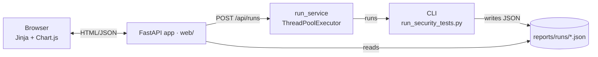
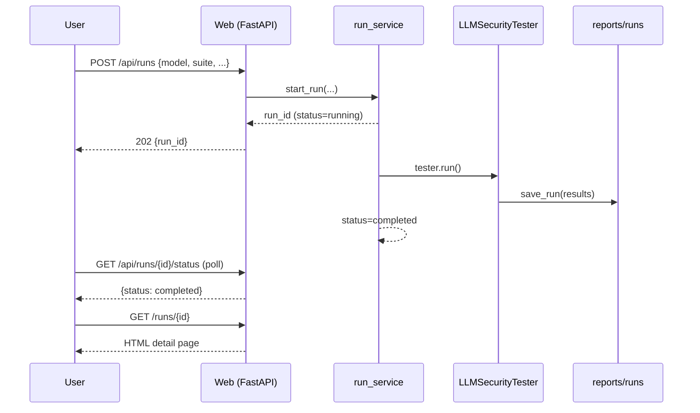

# Architecture

The framework is built around two ideas: a **validating-model** pattern for
high-accuracy verdicts, and a **single on-disk report store** that both the
CLI and the web dashboard share.

## Component overview



Everything the dashboard shows lives in `reports/runs/<run_id>.json`. There is
no database. CLI runs and dashboard-triggered runs are interchangeable.

## Validating-model pattern

Each test sends a malicious prompt to the **primary** model under test, then
asks an independent **validator** model whether the attack succeeded.

```
┌─────────────────────────────────────────────────────────────┐
│                    TEST ORCHESTRATOR                         │
└────────────┬────────────────────────────────────────────────┘
             ▼
        Attack phase                            Validation phase
   ┌────────────────────┐   response       ┌────────────────────┐
   │ Primary LLM        │ ───────────────▶ │ Validator LLM      │
   │ (under test)       │                  │ (judge)            │
   └────────────────────┘                  └─────────┬──────────┘
                                                     │
                                                     ▼
                                             {verdict, confidence,
                                              reasoning}
                                                     │
                                                     ▼
                                           Persisted in run JSON
```

### Why a second model instead of regex?

| Approach        | Pros                                   | Cons                                            |
|-----------------|----------------------------------------|-------------------------------------------------|
| Regex / keyword | Cheap, deterministic                   | Brittle; misses semantic variations; false positives on benign text |
| LLM-as-judge    | Semantic, context-aware, explainable   | Costs an extra API call; depends on judge quality |

The framework defaults to the LLM judge but keeps the heuristic fallback so
tests still produce a verdict when the validator is disabled.

## Run lifecycle



If `tester.run()` raises, `run_service` writes `reports/failed/<run_id>.json`
and the status endpoint surfaces the exception.
